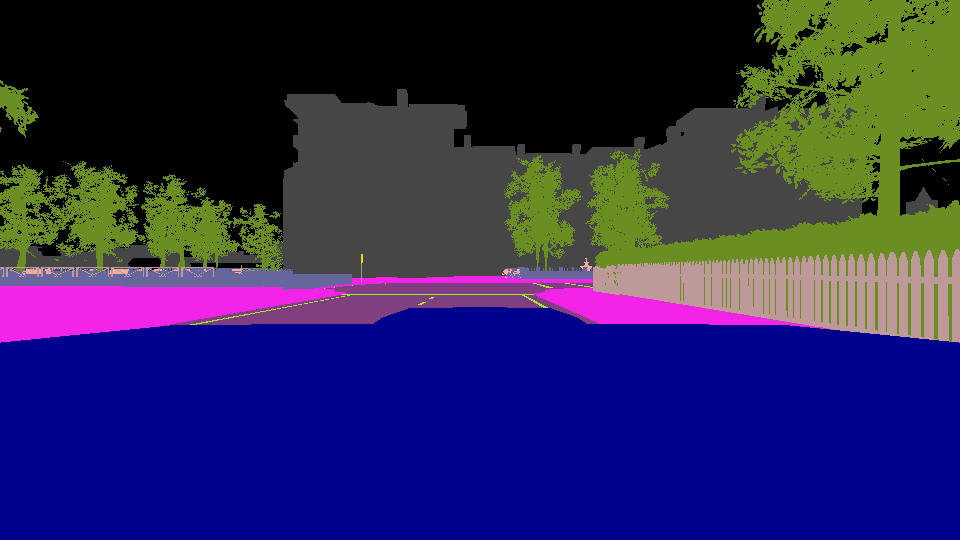

# Carla-Semantic-Segmentation
This repository holds my dissertation project during my time at the University of Bristol titled 'Deep Learning for Semantic Segmentation'.

Video demonstration of the proposed architecture predicting the semantic segmentation image, while driving in Town 3 of Carla.

## Summary

**Simulator:** Carla ver 0.9.5

**Data preprocessing:** Created front-view image representations of the Lidar Data, augment the collected datasets to create the different classes for the Warning Model

**Data augmentation:** Random rotations, translations, blur, brightness, occlusions.

**Architecture:** Modified U-net & custom CNN.

## Datasets

Three different datasets were recorded in total. The first dataset that was collected consisted of 6,000 frames.  It was recorded in Town 3 under clear weather conditions. In order to improve accuracy and robustness, a larger dataset with 30,000 frames was collected. 

The simulation was set to run at 30 FPS; however, the recording was happening at a much slower rate (2-3 FPS). It took roughly four and a half hours to gather the data; however, the dataset only represents roughly 17 minutes of driving with the "ego-vehicle". The datasets included both the training and validation data for the DNNs.  Again, this dataset was collected in Town 3, but with using all possible weather conditions, iterating every 2000 frames.

Lastly, a third dataset was collected, consisted of 6,000 frames, using six different kinds of weather. The dataset was used for testing the different architectures and evaluating the performance of the system.  Finally, the Python Client was redesigned in order to make it possible to run the prediction system in real-time without needing to pre-record any data.

It was discovered that it could be beneficiary to create a front-view image representation of the Lidar point cloud rather than using the whole point cloud. This has a benefit that the system only uses data that are actually needed for the segmentation
process. Also, it was simpler to integrate them with existing image segmentation networks. The code for creating the Lidar image is located in the CarlaClient file.

Ouput: 

  

**Data Augmentation**

For the warning model, in order to create the different classes; data augmentation was applied. However, instead of using data-augmentation to improve training performance, it was used to create the dataset containing different classes (rotation, blur, occlusion). The same dataset which was used for training the image segmentation model was augmented in four different ways. The dataset was divided into four equal-size parts, each containing 25% of the original dataset (7,500 images each). The first class contains the original images without applying any modification to them, which represent the quality standard that the system expects. The second class contains images that rotation or translation was applied to them, to simulate the event that the
sensor was moved from its place. Next, blur or random lightness were applied to simulate potential malfunction of the sensor.  Finally, black spots were applied to the images, to simulate potential occlusion from an object or due to sensor malfunction.

## Architecture

One of the objectives of this project was to develop a DNN architecture that can predict the
semantic segmentation map, which is required for planning and navigation in autonomous vehicles. A modified U-net network was used for predicting the segmentation map. The network's image input contains both the RGB and Lidar channels (256 x 512 x 6)

It was decided to add to the architecture a second DNN that will be detecting quality issues with the RGB camera sensor. Issues, such as camera rotation, blur or brightness, and occlusion. A custom CNN model was developed for classifying the image quality. The input is an RGB image (256 x 512 x 3).

## Results

One of the objectives of this study was to evaluate the contribution of sensor-fusion in the suggested architecture. In order to evaluate the performance of the two networks, two different techniques were applied. The first is the built-in function called "evaluate", which is provided by the Keras API. The second function used is a custom function that measures the mean intersection over union (Long, Shelhamer, and Darrell, 2014)

**RGB U-net**

<table>
<tr><td>

| Dataset       |   Accuracy    | Dice Coefficient |  
| ------------- | ------------- | -------------    |
| Training      |     96.91%    |       0.9806     |
| Validation    |     96.01%    |       0.9762     |
| Evaluation    |     87.69%    |       0.9485     |

</td><td>

| Weather ID    |   Mean IU     | 
| ------------- | ------------- | 
| CloudyNoon    |     52.51%    |       
| WetNoon       |     59.08%    |     
| WetCloudyNoon |     67.84%    |    
| MidRainyNoon  |     53.98%    |    
| HardRainNoon  |     50.53%    |      
| SoftRainNoon  |     55.05%    |      
</td></tr> </table>

**Sesnor-Fusion U-net**
<table>
<tr><td>

| Dataset       |   Accuracy    | Dice Coefficient |
| ------------- | ------------- | -------------    |
| Training      |     97.51%    |       0.9858     |
| Validation    |     96.61%    |       0.9817     |
| Evaluation    |     82.52%    |       0.9498     |

</td><td>
  
| Weather ID    |   Mean IU     | 
| ------------- | ------------- | 
| CloudyNoon    |     55.01%    |       
| WetNoon       |     62.40%    |     
| WetCloudyNoon |     71.47%    |    
| MidRainyNoon  |     57.00%    |    
| HardRainNoon  |     53.33%    |      
| SoftRainNoon  |     57.70%    |  

</td></tr> </table>

**Warning Model**

Overall, the network achieves an accuracy of 99.02% in the evaluation dataset. While testing the implementation in the simulator, there were no false predictions. It is worth mentioning here, that in each case, the severity of the augmentation was selected randomly. Furthermore, during the evaluation of the model, 59 images out of the 6000 were classified wrongly.  However, it was discovered that the majority of the misclassified images were due to the severity of the augmentation, specifically, in images where rotation or translation was barley visible or in images where occlusion was minimal. Also, it was observed that the weather conditions did not affect the network’s performance. The network was able to detect quality problems with the sensor even in rough weather conditions. It is evident that the model has a high performance overall.  However, more work is required in
order to improve accuracy when the augmentation is not severe and could have an impact in the performance of other modules.

## Discussion

From the results, it is clear that this architecture is able to predict a segmentation image that is close to the ground truth and assess the quality of the RGB image.
The segmentation model was able to achieve a satisfactory accuracy predicting the segmentation image.  However, the main limitation of this network is that the accuracy of the segmentation image drops with rough weather conditions. Sensor fusion techniques were used to improve performance and mitigate this.  Even though performance did improve with sensor-fusion,  still the effects of the rough weather conditions are visible.  This is evident in the [video](https://youtu.be/WV4RRIaQjTc) recording of the sensor-fusion model performing under different weather conditions  in  Town  1  of  Carla.  

The warning model proved to be much easier to develop and train.  Even though, is a custom architecture and no pre-trained weights were used,  the network achieves 99% of accuracy. However, one concern about the findings of this model was that slightly augmented images are not classified correctly.  This could indicate that the network is not suitable where tiny corruptions are
needed to be detected.

Taking all the above into consideration is safe to assume that DNNs models can be used for perception systems in AVs. However, issues like accuracy will always be present, but with further research, it is possible to minimise them. More importantly, though, the biggest drawback of DNNs is the black box architecture. Current methods are not able to verify and validate the robustness of this kind of systems.
